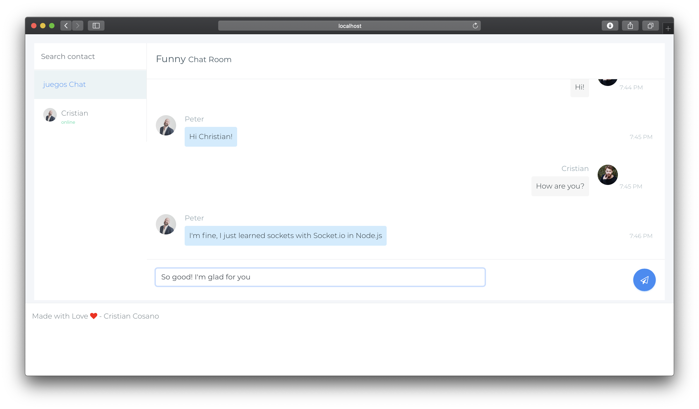

# Chat System  with Socket.io + Node.js 

### Features

- The app simulate a Chat Room
- The app works with two-way communication between client and server (sockets.io)
- Routing with ExpressJS

NOTE: This app is a proof of concept. It is not finished and contains errors. Use it only for learning purposes or to finish it. If you finish it, I will be grateful that you let me know

### How to use

To try the web-app, you need initialize the project using `npm install` command. Then run it using `npm run dev`